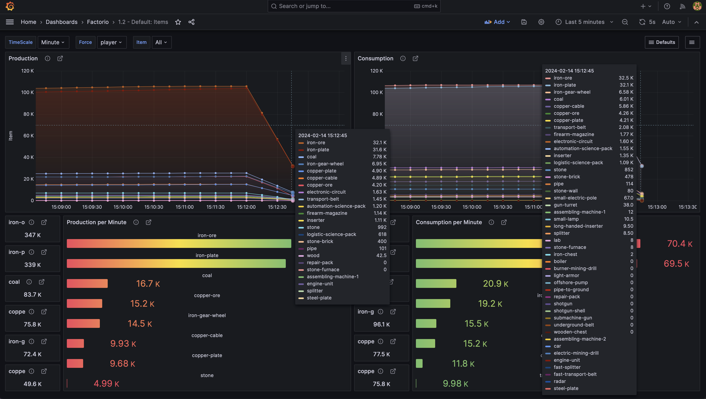

# graftorio

A Prometheus and Grafana stack configured to scrape from various node-exporters, backed by Factorio metrics.

This project requires the [graftorio2](https://github.com/remijouannet/graftorio2) mod to be installed.

## server

Deploys:

- prometheus
- grafana

### Prometheus

Prometheus is expecting two `node-exporter` instances on given network ips. Each of these instances is in essence the local ip address of all the machines you have where you can play Factorio from.

Since it is scraping from various nodes, it is also dropping the `instance` label.

### Grafana

Grafana is configured to be deployed with the default credentials.

## client

Different docker compose files are provided based on the os architecture of the machine that will run the game. This is simply because the default location of `graftorio2` mod files is different in this situation.
